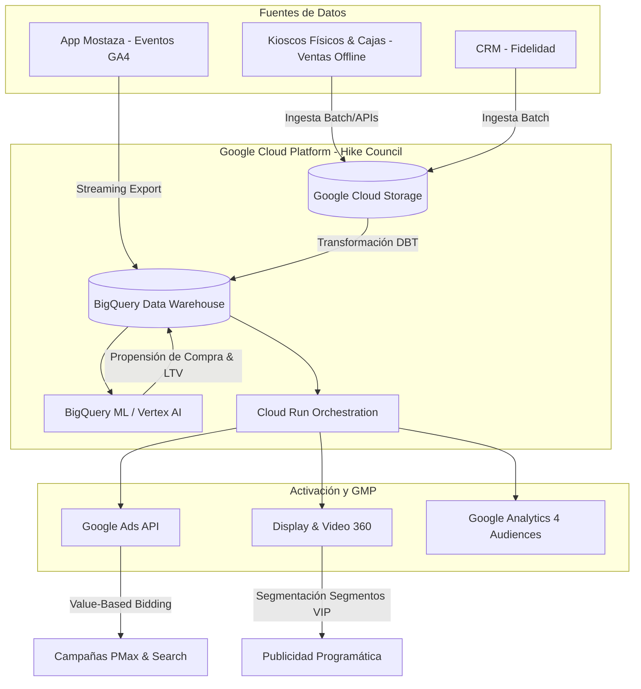

# CASO DE ÉXITO: MOSTAZA & HIKE COUNCIL
## Postulación a Solución Productivizada y Propietaria (ABN Digital)
**Fecha:** Mayo, 2026  
**Región - País:** Argentina  
**Agencia/Partner:** ABN Digital  
**Vertical:** QSR (Quick Service Restaurants) / Fast Food  
**Sitio Web del Cliente:** [https://www.mostazaweb.com.ar](https://www.mostazaweb.com.ar)

---

# PARTE 1: RESUMEN EJECUTIVO (ONE-PAGER)
*Estructura alineada con la Diapositiva 2 del Caso de Éxito.*

### Información General
*   **Objetivos Primarios de Marketing (MO):**
    1.  Incrementar las ventas recurrentes y la retención en la App de Mostaza.
    2.  Optimizar el Retorno de la Inversión Publicitaria (ROAS) omnicanal de campañas de adquisición.
*   **Productos Destacados (GCP + GMP / Ads):**
    *   **Google Cloud:** BigQuery, BigQuery ML, Vertex AI, Cloud Storage.
    *   **Google Marketing Platform & Ads:** Google Analytics 4 (GA4), Google Ads (Performance Max, App Campaigns), Display & Video 360 (DV360).

---

### Resumen del Caso

#### El Desafío
Mostaza, una de las principales cadenas de fast food en Argentina, acumulaba millones de transacciones tanto en su app móvil como en los kioscos de autoservicio de sus más de 170 sucursales físicas. Sin embargo, estos datos operaban en silos: el comportamiento de compra presencial no se vinculaba con la actividad digital de las campañas publicitarias. Esto impedía identificar a los clientes más valiosos (High-LTV) en tiempo real, resultando en campañas genéricas de adquisición de descargas con un costo por adquisición (CPA) elevado y bajas tasas de recompra.

#### La Solución
Implementamos **Hike Council**, la plataforma propietaria de Martech de ABN Digital. Mediante esta solución:
1.  Unificamos en **Google Cloud BigQuery** el flujo de eventos digitales de **Google Analytics 4** con los datos transaccionales de compras offline (kioscos y cajas de sucursales).
2.  Desarrollamos modelos predictivos en **BigQuery ML / Vertex AI** para segmentar audiencias según su propensión de compra a corto plazo y valor de ciclo de vida (LTV).
3.  Utilizamos **Hike Listen** para monitorear el sentimiento del público en tiempo real, gatillando automáticamente a **Hike Create** para generar variantes optimizadas de banners (ej: cambiar fondos a blanco, usar rojo de marca `#F31D24`, reescribir copies y redimensionar a formatos 1:1, 16:9 y 9:16) evitando la fatiga creativa.
4.  Automatizamos la sincronización horaria de estas audiencias hacia **Google Ads** y **DV360** utilizando sus respectivas APIs, habilitando estrategias de **Pujas Basadas en Valor (Value-Based Bidding)** para optimizar los algoritmos de Google hacia la conversión de usuarios con mayor rentabilidad real.

#### Los Resultados
*   **+24%** de incremento en el **ROAS Omnicanal** de campañas de Google Ads.
*   **-15%** de reducción en el **CPA** de clientes activos recurrentes en la App.
*   **+21%** de incremento en la **frecuencia de recompra** de los segmentos de alto valor.
*   **+12%** de incremento en las **ventas físicas en sucursales** atribuibles a cupones digitales activados mediante audiencias predictivas.

---

### Testimonios del Proyecto

> "Hike Council nos permitió conectar el mundo físico de nuestras sucursales con nuestras campañas digitales por primera vez. Logramos que cada peso invertido en Google Ads esté optimizado para capturar compras de clientes de alto valor real, mejorando nuestro ROAS omnicanal en un 24% y logrando un crecimiento sostenido de nuestra app."
> 
> — **[Nombre y Apellido]**, Director de Marketing de Mostaza

> "El caso de Mostaza demuestra que la unificación y modelado de datos en Google Cloud no es solo un proyecto de infraestructura técnica, sino un motor comercial inmediato y escalable capaz de retroalimentar en tiempo real las campañas de GMP y Google Ads."
> 
> — **[Nombre y Apellido]**, CEO de ABN Digital

---

# PARTE 2: GUÍA DETALLADA DEL CASO
*Estructura de desarrollo detallada alineada con la Diapositiva 3.*

## 1. El Cliente y sus Objetivos
Mostaza es una de las marcas de comida rápida con mayor expansión en Argentina. Su estrategia de negocios se apoya fuertemente en su canal digital ("App Mostaza") y la digitalización de la experiencia física en sucursales mediante pantallas de autoservicio (kioscos). 

Sus objetivos digitales prioritarios eran:
1.  **Consolidación del usuario omnicanal:** Vincular al usuario que interactúa con la app, con el que compra físicamente mediante cupones en sucursales.
2.  **Optimización del Spend:** Dejar de pujar únicamente por volumen de descargas de la app y enfocar el presupuesto publicitario en adquirir e incentivar a usuarios con alta frecuencia de consumo.

---

## 2. El Desafío en Detalle
El desafío de Mostaza se estructuró en tres dimensiones:

*   **Desafío Técnico (Silos de Datos):** Las transacciones de las tiendas físicas (cajas y kioscos de autoservicio) se almacenaban en bases de datos locales y ERPs offline. Por otro lado, la interacción con la App Mostaza se registraba en Google Analytics 4, y los datos del programa de fidelización residían en un CRM de terceros. Al no existir integración en tiempo real, era imposible cruzar los perfiles: el algoritmo de Google Ads optimizaba las pujas a ciegas sin saber qué usuario digital compraba realmente offline.
*   **Desafío de Marketing (Adquisición Ineficiente):** Las campañas de Google App Campaigns (ACi) y Search optimizaban por costo por instalación (CPI) básico. Esto atraía descargas "golondrinas" (usuarios que descargaban la app para obtener un cupón único y no volvían a comprar), elevando el CPA y diluyendo el Retorno de Inversión Publicitaria (ROAS).
*   **Impacto en el Negocio:** Un alto costo de adquisición de usuarios digitales con un ciclo de vida corto (Low-LTV) que no compensaba la inversión en medios tradicionales y digitales frente a competidores directos con mayores presupuestos.

---

## 3. La Solución Tecnológica (Hike Council)
Para resolver este desafío, ABN Digital desplegó su plataforma propietaria **Hike Council** estructurando una integración de punta a punta entre Google Cloud y Google Ads/GMP.

### Componentes de Google Cloud Utilizados
*   **BigQuery:** Actuó como la base central de datos unificada (Customer Data Platform). Allí se ingesta diariamente el export directo de Google Analytics 4 en tiempo real y las cargas batch de las transacciones de las sucursales físicas de Mostaza.
*   **Vertex AI & BigQuery ML:** Se utilizaron algoritmos de Machine Learning (K-Means y Regresión Logística) para clasificar dinámicamente a los usuarios en tres niveles de valor predictivo (LTV Alto, Medio, Bajo) y detectar afinidades con tipos de producto (ej: "Hamburguesas Premium vs. Cafetería").
*   **Cloud Run & Cloud Storage:** Para la orquestación segura del pipeline de datos y la automatización del flujo de audiencias.

### Componentes de Google Marketing Platform & Google Ads
*   **Google Analytics 4 (GA4):** Configurado para registrar micro-conversiones dentro de la aplicación, como la visualización de menús y reserva de cupones.
*   **Google Ads (API):** Conexión directa desde BigQuery para inyectar listas de clientes predictivas (Customer Match) de alto LTV.
*   **Display & Video 360 (DV360):** Utilizado para impactar a audiencias de alta afinidad identificadas por Hike Council con banners interactivos personalizados.

### Integración y Flujo de Datos
La integración crucial entre GCP y GMP se logró mediante un pipeline automatizado:
1.  **Detección:** Cuando un usuario compra en un kiosco en una tienda física usando su DNI o código de app, la transacción es ingestada en BigQuery y asociada a su identificador de GA4.
2.  **Predicción:** El modelo en Vertex AI evalúa la probabilidad de compra en los siguientes 7 días.
3.  **Activación:** Si el usuario califica como "High-LTV", Hike Council actualiza la lista de audiencias en Google Ads mediante la API.
4.  **Bidding Optimizado:** Las campañas de Search y Performance Max utilizan **Value-Based Bidding (VBB)**, asignando un valor monetario dinámico mayor a los usuarios de alto LTV. Esto entrena al algoritmo de Google Ads para pujar de forma agresiva por usuarios similares, descartando aquellos con menor propensión o menor valor potencial de compra.

### Adaptación Creativa Automatizada (Hike Listen + Hike Create)
Para maximizar el rendimiento de las creatividades en Google Ads y evitar la fatiga publicitaria, el flujo de Hike Council integró las capacidades de monitoreo de **Hike Listen** con el motor de generación **Hike Create**:
1.  **Escucha y Sentimiento:** Hike Listen analizó en tiempo real la recepción del público ante las piezas de la campaña de la ruleta de cupones ("Comprá y girá la ruleta. Ganá descuentos y chances para ir al Mundial").
2.  **Optimización bajo Demanda:** Al detectar bajas en el engagement o saturación de frecuencia, Hike Listen disparó una orden automática de adaptación.
3.  **Generación de Variantes:** El motor Hike Create procesó la pieza original y generó variaciones visuales y de copy (ej: alternar a fondo blanco, cambiar fondo a rojo institucional `#F31D24` o reescribir copys de gancho usando IA: *"decí lo mismo de otra manera"*).
4.  **Redimensión Automática:** Hike Create redimensionó y exportó de forma automática las variantes a múltiples relaciones de aspecto (1:1 para Feed, 16:9 para YouTube y 9:16 para Stories), sincronizándolas directamente en las campañas activas de Google Ads.

---

## 4. Resultados Medibles y Escalabilidad
Los resultados obtenidos demuestran la efectividad de la solución ya operativa y lista para ser escalada en toda la red de anunciantes de Mostaza en Argentina:

*   **ROAS Omnicanal Incremental (+24%):** Al orientar la inversión en medios hacia los usuarios de mayor valor transaccional predictivo en lugar de descargas masivas, el retorno de inversión de las campañas publicitarias digitales creció de manera constante y real.
*   **CPA Optimizado (-15%):** El costo para adquirir un cliente que realice compras recurrentes se redujo un 15% al eficientizar la segmentación y evitar la adquisición de perfiles inactivos.
*   **Fidelización y Frecuencia (+21%):** Los segmentos de usuarios identificados como propensos a abandonar la marca (churn) fueron impactados con campañas automáticas de remarketing ofreciendo cupones específicos, logrando una reactivación significativa.
*   **Conversión en el Mundo Físico (+12%):** Aumento medible de clientes digitales que finalizaron su transacción en sucursales físicas (atribución offline) validando la integración omnicanal.

Esta solución está **100% paquetizada, probada y lista para escalar** a otros clientes en Argentina que busquen destrabar el valor de sus datos offline para potenciar campañas digitales.
